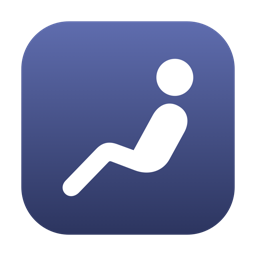
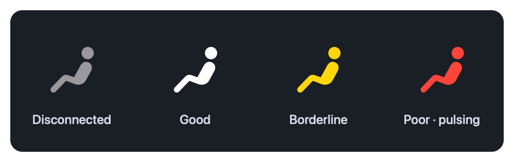
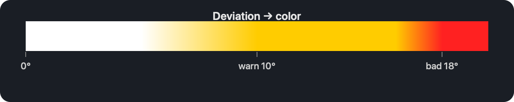
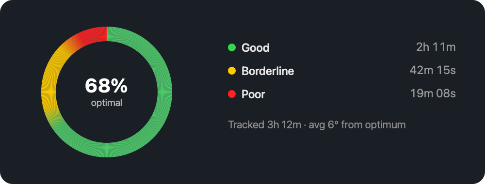

<div align="center">



# SitUpright

A native macOS menu bar app that uses AirPods / headphone motion (`CMHeadphoneMotionManager`)
to detect forward head posture and remind you to sit upright. Everything runs locally —
no camera, no cloud, no analytics, no external server.

**macOS 14 Sonoma or newer**

### [⬇︎ Download SitUpright 1.0.8 (.dmg)](https://github.com/LeonardPertsch/situpright-macos/releases/latest/download/SitUpright-1.0.8.dmg)

</div>

> **First launch:** the app is ad-hoc signed (not notarized), so macOS Gatekeeper blocks it on
> download. Right-click the app → **Open** → **Open**, or run
> `xattr -dr com.apple.quarantine /Applications/SitUpright.app`. Notarized distribution would
> require a paid Apple Developer ID.

## The menu bar icon

The icon lives in the menu bar at all times and changes color to reflect your posture — white
when upright, yellow when you start leaning forward, and red (gently pulsing) when you slouch.



The color is blended **continuously** from your smoothed deviation angle, so it morphs smoothly
instead of snapping between states. The yellow band is intentionally wide, so the icon lingers
on yellow well before it turns red.



## Statistics

The popover shows an all-time posture ring: the arcs are how long you spent in each band
(good / borderline / poor), the center is your share of time at the optimum, and the caption
shows total tracked time and your average deviation from the calibrated optimum. Totals persist
across launches; **Reset** clears them.



---

## Build & run

1. Open `SitUpright.xcodeproj` in Xcode 15 or newer.
2. Select the **SitUpright** scheme (Xcode generates it on first open).
3. Signing: macOS allows local runs without a paid account. If the target shows a
   signing error, select the target → **Signing & Capabilities** → set **Team** to
   your personal team (or leave "Sign to Run Locally"). No paid Developer account is
   required to build and run on your own Mac.
4. Press **Run**. The app has no window and no Dock icon — look for the seated-figure
   icon in the menu bar.

If you prefer to regenerate the project from scratch, see `project.yml` (XcodeGen).

## Using it

1. Launch. The menu bar icon is **gray** until motion-capable headphones are available.
2. Put on compatible AirPods (see hardware note), click the icon, press **Start Tracking**.
   The first start triggers the macOS **Motion & Fitness** permission prompt — allow it.
3. Sit up straight and press **Calibrate Upright Posture** to store your neutral baseline.
4. The menu bar icon now live-updates:
   - **gray** — tracking off / headphones disconnected / not calibrated / access denied
   - **white** — good posture
   - **yellow** — borderline (past the warning angle)
   - **red, pulsing** — slouching (past the bad-posture angle)
5. If poor posture persists past the alert delay (default 10s), you get a local notification
   and a short ping. Both are optional (toggles in the popover). Pick the tone from several
   system sounds, and set how often the ping **repeats** while you stay in the red zone. The
   ping uses a system sound that **mixes** with other audio — it never interrupts, pauses, or
   ducks music. The notification fires once per slouch and re-arms after you sit back up.

---

## Verified API facts, permissions, and limitations

These were checked against the requirement to not fake motion tracking:

- **`CMHeadphoneMotionManager` is available on macOS 14.0+.** It delivers real
  `CMDeviceMotion` (attitude quaternion) from motion-capable headphones. This app uses
  `authorizationStatus()`, `isDeviceMotionAvailable`, `startDeviceMotionUpdates`,
  `stopDeviceMotionUpdates`, and the connect/disconnect delegate callbacks. Nothing is
  simulated.
- **Motion permission is required.** `Info.plist` includes `NSMotionUsageDescription`.
  Without it the app cannot read motion and the permission prompt won't appear. Grant/re-grant
  under **System Settings › Privacy & Security › Motion & Fitness**.
- **No dedicated sandbox entitlement exists for headphone motion.** The app is therefore
  shipped **non-sandboxed** (`SitUpright.entitlements` has App Sandbox off), which is the
  reliable configuration for a locally distributed utility. Sandboxing for Mac App Store
  distribution is not guaranteed to keep motion updates flowing and would need separate
  validation — that part genuinely depends on Apple's entitlement behavior and is called
  out rather than faked.
- **Hardware requirement (real limitation):** motion data only exists on headphones with
  sensors — **AirPods Pro, AirPods (3rd gen), AirPods Max, and motion-capable Beats**.
  Regular AirPods (1st/2nd gen) and wired headphones report `isDeviceMotionAvailable == false`;
  the app correctly shows this as disconnected/gray. There is no software workaround.
- **`LSUIElement` = true** hides the Dock icon so the app lives only in the menu bar
  (also reinforced by `NSApp.setActivationPolicy(.accessory)`).
- **Launch at login** uses `SMAppService.mainApp` (macOS 13+). For the toggle to persist
  reliably the app should be run as a proper bundle (i.e. built by Xcode), which it is.
- **Notifications** use `UserNotifications`. Permission is requested at launch; alerts are
  rate-limited by a cooldown so you are never spammed.

Nothing here needs a paid Apple Developer account to build and run locally. The only thing
that does require one is **notarized distribution to other Macs** (Developer ID signing +
notarization) — not needed for personal use.

---

## How the posture algorithm works

1. **Acquisition** (`HeadphoneMotionService`): each `CMDeviceMotion` sample is reduced to
   its attitude **quaternion** plus a monotonic timestamp and forwarded on the main thread.
   Quaternions avoid the gimbal-lock/wrap problems of raw Euler pitch.
2. **Calibration** (`PostureDetector.calibrate`): pressing calibrate snapshots the current
   quaternion as your upright **baseline**, persisted in `UserDefaults`. The app never judges
   absolute head orientation — only deviation from *your* neutral.
3. **Deviation**: for each new sample it computes the relative rotation
   `inverse(baseline) * current`, then extracts the **pitch (nod) component**. Forward head
   posture is a downward nod; left/right head turns (yaw) are ignored, so casually looking
   around does not trigger alerts.
4. **Smoothing**: the pitch magnitude is passed through an **exponential moving average**,
   which suppresses sensor jitter and momentary movements, so only sustained posture matters.
5. **Thresholds**: the smoothed angle is classified as good / borderline / poor using a
   warning angle (default 10°) and a bad angle (default 18°). The **Sensitivity** slider
   scales both thresholds up or down.
6. **Sustained alert**: poor posture must persist continuously for the **alert delay**
   (default 8 s) before a notification fires, and a cooldown prevents repeat spam.

## Project layout

```
SitUpright/
├─ SitUpright.xcodeproj/        ready-to-open Xcode project
├─ project.yml                  optional XcodeGen definition (regeneration only)
├─ README.md
└─ SitUpright/
   ├─ PostureApp.swift            @main entry (menu-bar-only App)
   ├─ AppDelegate.swift           wires services together, accessory activation
   ├─ MenuBarController.swift     NSStatusItem + popover + live icon tinting
   ├─ PosturePopoverView.swift    SwiftUI popover UI
   ├─ HeadphoneMotionService.swift  CoreMotion acquisition (no math)
   ├─ PostureDetector.swift       calibration + smoothing + threshold math (no CoreMotion I/O)
   ├─ NotificationService.swift   UserNotifications + cooldown
   ├─ SettingsStore.swift         UserDefaults persistence + launch-at-login
   ├─ Info.plist                  LSUIElement + NSMotionUsageDescription
   └─ SitUpright.entitlements     App Sandbox off (documented)
```
